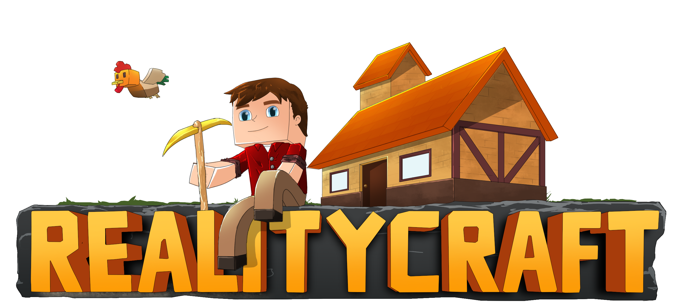
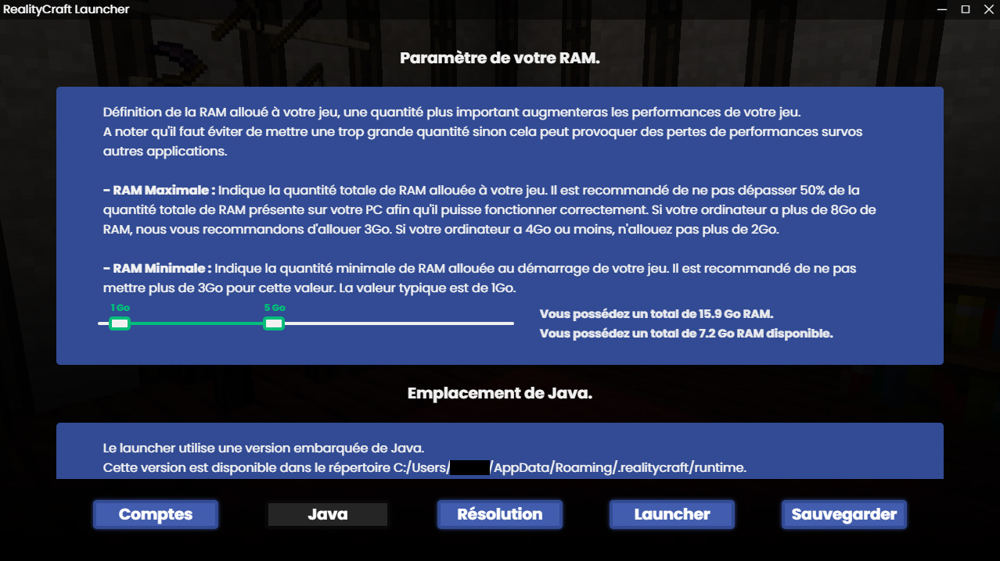

<h1 align="center">RealityCraft Launcher</h1>

#### [
]() *(Ce fork est utilisé par le serveur RealityCraft.)*

---
### **<ins>
Conditions d'utilisation :
**
- Ce fork ne peut être utilisé pour vos projets
- Si ce projet vous intéresse, créez votre propre fork du projet [CraftLaunch](https://github.com/luuxis/Selvania-Launcher)

---

### **<ins>
Fonctionnalitées du launcher :
**

- ✅ Mise à jour automatiques via github.

- 🔴 Option pour mettre le launcher en maintenance.

- 🔒 Authentification Microsoft et Mojang AB.

 
- 📰 Fil d'actualité intégré nativement au launcher.

- 🚹 Gestionnaire de skins.

- ⚙️ Gestion intuitive des paramètres, y compris un panneau de configuration Java.

- 🟢 Statut serveur complet.

    - Opérationnel ou hors ligne.
    
    - Nombre de joueurs connectés.

- ☕ Installation de Java automatique.

    - Si vous avez installé une version incompatible de Java, nous installerons la bonne pour vous.
    
    - Vous n'avez pas besoin d'avoir Java installé pour exécuter le launcher.

---

### **<ins>
Aperçus :
**

 *Accueil du launcher*

&nbsp;

 *Paramètres JAVA*

---
### **<ins>
Téléchargement :
**

Vous pouvez télécharger le launcher à partir des [Releases GitHub](https://github.com/MrCyberium/RealityCraft-Launcher/releases).

Plateformes supportées :

- Windows 
- Linux
- MacOS

Si vous téléchargez à partir des Releases, sélectionnez le programme d'installation de votre système.

 Plateforme | Fichier |
| -------- | ---- |
| Windows x64 | `RealityCraft-Launcher-win-x64.exe ` |
| macOS x64 | `RealityCraft-Launcher-mac-x64.dmg` |
| macOS arm64 | `RealityCraft-Launcher-mac-arm64.dmg` |
| Linux x64 | `RealityCraft-Launcher-linux-x86_64.AppImage` |

---

 

Si vous avez des questions, un problème ou des suggestions n'hésitez pas à rejoindre notre discord :

 

[
](https://discord.gg/ny2dk8A) 
---

 
 